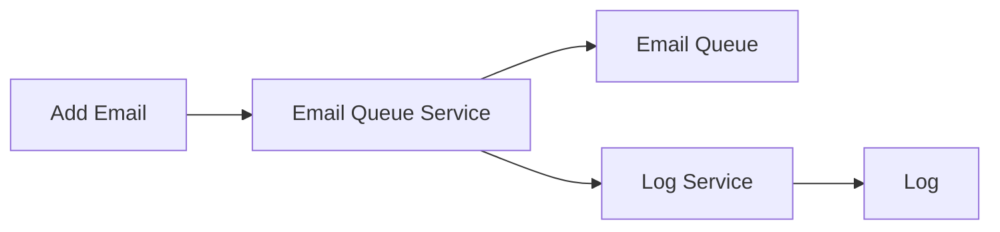
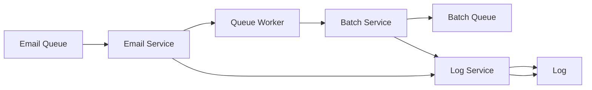

# Email Queue Service

The Email Queue Service is a robust system designed to ensure the reliable delivery of single or bulk emails to recipients, guaranteeing that each email reaches its intended destination. The system is structured as a three-part architecture, comprising an Email Service, an Email Queue Process, and an Email Batch Process.

The Email Service handles the creation and dispatching of emails, the Email Queue Process manages the queuing and prioritization of email requests, and the Email Batch Process processes bulk email operations efficiently.

The following diagrams illustrate the primary components and workflows of each part of the system.

## Email Service. 


## Email Queue Process. 


## Email Batch Process. 
```mermaid
graph LR
    batchQueue[Batch Queue] --> batchService[Batch Service] --> batchWorker[Batch Worker] --> emailClient[Email Client] --> emailRecipient[Email Recipient];
    batchService --> logService[Log Service] --> Log[Log];
    emailClient --> logService --> Log[Log];

   